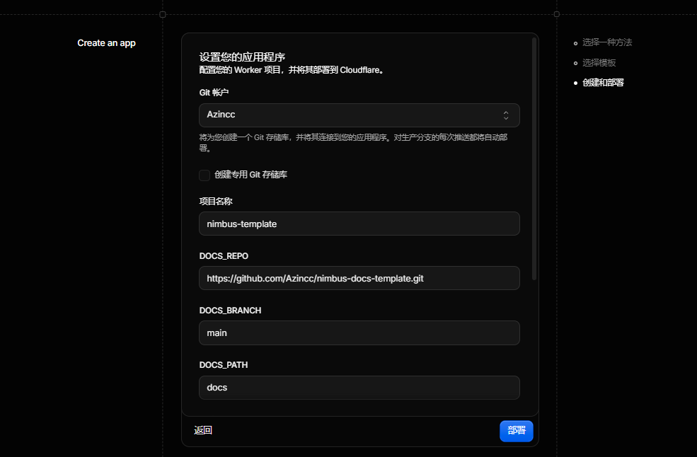

部署和后续配置都可以在 Cloudflare 控制台完成，无需安装开发工具或编辑代码。模板默认读取[示例仓库](https://github.com/Azincc/nimbus-docs-template.git) `main` 分支中的英文 `docs/`，部署后也可以换成自己的文档仓库。

## 部署到 Cloudflare

<!-- deploy-button:start -->
[](https://deploy.workers.cloudflare.com/?url=https://github.com/Azincc/nimbus-docs-template)
<!-- deploy-button:end -->

1. 点击上方 **Deploy to Cloudflare**，按提示授权 GitHub，创建自己的模板仓库和 Worker。
2. 确认构建命令为 `pnpm run build`、部署命令为 `pnpm run deploy`，根目录为仓库根目录。体验示例时，保留三个文档源字段的预填值；发布自己的文档时，填写实际的公开仓库、分支和文档目录。
3. 开始部署。成功后，打开 Cloudflare 提供的 `workers.dev` 地址。



图中预填的是英文示例的文档源参数。保留这些值，或换成自己的仓库、分支和目录后，点击“部署”。

以后要更换文档源、站点地址、Logo 或 favicon，打开这个 Worker 的 **设置（Settings）→ 构建（Builds）→ 变量和机密（Variables and secrets）**，添加或修改对应变量。保存后，到构建记录中选择 **重试构建（Retry build）**。

如果控制台提示“未配置构建变量或密钥”，表示还没有在这里添加变量，构建会继续读取模板默认值。因此，首次部署可能显示英文示例文档，复制模板不会自动把文档源改成你的仓库。


上图展示了一个已有站点的配置，列表不会自动列出所有生效配置。只需添加要修改的参数，列表中已有的参数直接编辑即可。图中的 `DOCS_CONFIG_PATH`、`SITE_URL` 都是可选项，不用逐项照抄。

## 构建变量

首次部署时，Cloudflare 表单只显示 `DOCS_REPO`、`DOCS_BRANCH`、`DOCS_PATH` 三项，每项都需要填写。体验示例时保留预填值，发布自己的文档时改成实际文档源。

| 初次部署字段 | 预填值 | 如何填写 |
| --- | --- | --- |
| `DOCS_REPO` | `https://github.com/Azincc/nimbus-docs-template.git` | 改成自己的文档仓库 HTTPS 地址，如 `https://github.com/你的用户名/文档仓库.git` |
| `DOCS_BRANCH` | `main` | 文档所在的分支名称 |
| `DOCS_PATH` | `docs` | 仓库里的文档文件夹；文档在仓库根目录时填 `.` |

下面这些参数都是可选项，首次部署时不会出现在表单中。有需要时，再到 **设置 → 构建 → 变量和机密** 添加。**名称和值分别填在对应的输入框中，值不加引号**。

| 可选变量 | 不设置时的行为 | 需要时如何填写 |
| --- | --- | --- |
| `DOCS_CONFIG_PATH` | 自动读取 `DOCS_PATH` 目录里的 `site.json`；没有文件时使用通用配置 | 配置文件放在其他位置时，填写实际路径，从文档源仓库根目录算起 |
| `SITE_URL` | 不指定正式站点地址 | 自己的完整站点地址，如 `https://你的Worker.你的子域.workers.dev` |
| `SITE_LOGO` | 使用 JSON 中的 Logo，没有时使用内置 Nimbus Logo | Logo 的 HTTP(S) 图片地址，或仓库里的图片路径 |
| `SITE_FAVICON` | 使用 JSON 中的 favicon，没有时使用内置 Nimbus Logo | 浏览器图标的 HTTP(S) 图片地址，或仓库里的图片路径 |

没有 `site.json` 也能直接部署，无需新建文件或添加空变量。如果手动填写了 `DOCS_CONFIG_PATH`，对应文件就必须存在，JSON 格式也必须正确。

默认的 `docs/` 是英文示例。要部署这份中文文档，保留默认文档仓库和 `main` 分支，将 `DOCS_PATH` 改为 `docs-zh-CN`，模板就会自动读取 `docs-zh-CN/site.json`。如果旧部署中已经设置了 `DOCS_CONFIG_PATH`，请删除它或改为 `docs-zh-CN/site.json`，再保存并重新构建。

`SITE_URL` 用于生成搜索引擎等页面信息，**不会绑定自定义域名**。不设置也能访问网站，只会省略需要正式地址的 canonical、SEO 信息和 sitemap。确定站点地址后，再添加这个变量并重新构建。

不设置图片变量时，模板先用站点配置中的对应图片，没有配置就用内置的 Nimbus 官方 Logo。已有的 `default` 和空白值也按这个规则处理。

填写图片 URL 或仓库路径后，会优先使用变量指定的图片。仓库路径从文档源仓库根目录算起，例如 `docs-zh-CN/assets/nimbus-mark.svg`。详见[品牌资源](./site-config.md#品牌资源)。

旧部署需要先[更新模板](./deployment/template-update.md)。更新后，已保存的构建变量仍然优先。删除旧的 `DOCS_CONFIG_PATH` 才会启用自动查找，其他不再需要的可选变量也可以删除。

公开仓库不需要 `DOCS_TOKEN`。如果文档在私有仓库中，在同一个 **构建 → 变量和机密** 区域添加 `DOCS_TOKEN`，类型选择 **Secret**。填入的 GitHub Token 只能授权目标仓库，权限设为 **Contents: Read-only**。Token 只在 Git 拉取时使用，不能写入仓库文件或 URL。详见[私有仓库部署](./deployment/private-repository.md)。

这些参数需要设为 **构建** 变量，普通运行时变量不会自动提供给构建。保存参数后，选择 **Retry build** 才会更新网站。逐步操作见[修改部署配置](./deployment/configuration.md)。

文档和模板在同一构建仓库、同一分支时，推送文档即可触发自动构建。使用独立文档仓库时，按[原文档仓库构建挂钩](./deployment/deploy-hook.md)连接自动更新。

## 本地运行

需要在电脑上开发模板时，准备 Git、Node.js 22.12.0 或更新版本，以及 pnpm 10.2.0，然后运行：

```sh
git clone https://github.com/Azincc/nimbus-docs-template.git
cd nimbus-docs-template
pnpm install --frozen-lockfile
pnpm dev
```

也可以使用 npm：运行 `npm ci` 安装依赖，再运行 `npm run dev`。其他命令同样可将 `pnpm <命令>` 换为 `npm run <命令>`。

打开终端输出的本地地址即可浏览文档。开发命令会先拉取 GitHub 上的文档，因此首次运行需要网络连接。

`pnpm dev` 和 `pnpm build` 都从配置的远程仓库读取内容。直接修改本地 `docs/` 或 `docs-zh-CN/` 不会改变远程文档版本。要发布自己的内容，先将修改提交并推送到配置对应的仓库和分支，再重新构建。

## 构建与预览

```sh
pnpm build
pnpm preview:cf
```

构建会依次拉取文档、转换 Markdown 和资源、校验站点配置，再生成静态页面和搜索索引。若本地链接缺失或站点配置无效，先修复源文件，再重新构建。

预览时，打开[编写文档](./writing-docs.md)和[站点配置](./site-config.md)，检查示例页面、相对链接和主题效果。页脚显示本次构建实际读取的文档提交 SHA。

确认构建结果后，可以运行 `pnpm run deploy` 发布到 Cloudflare，发布时需要 Cloudflare 部署授权。部署命令只能使用构建成功后生成、且未被修改的文件。修改站点后，要先重新执行 `pnpm build`。

开发模板时，使用 `pnpm test` 运行核心测试，构建后使用 `pnpm check` 检查 Astro 与 TypeScript（`pnpm typecheck` 为同义命令）。`pnpm e2e:dev --port 8787` 用于启动已构建产物，供浏览器测试访问。
