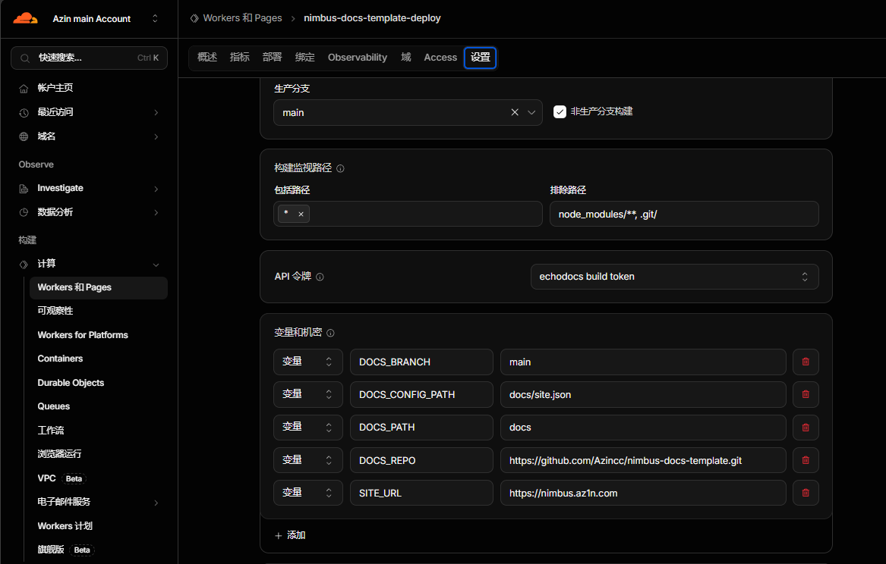

Deploy and change settings in the Cloudflare dashboard without installing development tools or editing code. By default, the template reads `docs/` on the `main` branch of the [example repository](https://github.com/Azincc/nimbus-docs-template.git). You can switch to your own document repository after deployment.

## Deploy to Cloudflare

<!-- deploy-button:start -->
[](https://deploy.workers.cloudflare.com/?url=https://github.com/Azincc/nimbus-docs-template)
<!-- deploy-button:end -->

1. Click **Deploy to Cloudflare** above. Follow the prompts to authorize GitHub and create your template repository and Worker.
2. Confirm the build command is `pnpm run build`, the deploy command is `pnpm run deploy`, and the root directory is the repository root. Keep the three prefilled source values for the example, or enter your public repository, branch, and document directory.
3. Start the deployment. After it succeeds, open the `workers.dev` address provided by Cloudflare.


Keep the prefilled values to deploy the public example, or enter your own document source. The screenshot uses the Chinese dashboard; variable names are the same in every language.

To change the document source, site URL, logo, or favicon later, open the Worker's **Settings → Builds → Variables and secrets**, add or edit the relevant variables, save, and select **Retry build** in the build history.

The first deployment may show the example documents. A message saying no build variables or secrets are configured means you have not added them in the dashboard; the template still uses its defaults. Copying the template does not automatically change the document source to your repository.



This screenshot shows an existing site's configuration; the list is not generated automatically. Click **Add** for a missing variable, or edit an existing value. Add only the variables you want to change; you do not need to copy every row or set the optional `DOCS_CONFIG_PATH` and `SITE_URL` values shown here.

## Build variables

The initial Cloudflare deployment form shows only `DOCS_REPO`, `DOCS_BRANCH`, and `DOCS_PATH`. All three displayed fields need values. Keep the prefilled values for the example, or change them to your own document source.

| Initial field | Prefilled value | What to enter |
| --- | --- | --- |
| `DOCS_REPO` | `https://github.com/Azincc/nimbus-docs-template.git` | Your document repository's HTTPS URL, such as `https://github.com/your-user/your-docs.git` |
| `DOCS_BRANCH` | `main` | The branch containing the documents |
| `DOCS_PATH` | `docs` | The document directory; use `.` if documents are at the repository root |

The following optional variables are absent from the initial form. Add them later in **Settings → Builds → Variables and secrets** only when you need an override. Enter **names and values in their separate fields, without quotes**.

| Optional variable | Behavior when not set | What to enter when needed |
| --- | --- | --- |
| `DOCS_CONFIG_PATH` | Automatically read `site.json` in `DOCS_PATH`; use generic settings if no file exists | A different configuration path relative to the source repository root |
| `SITE_URL` | No public origin is specified | Your complete site URL, such as `https://your-worker.your-subdomain.workers.dev` |
| `SITE_LOGO` | Use the JSON logo or the built-in Nimbus logo | An HTTP(S) image URL or repository image path |
| `SITE_FAVICON` | Use the JSON favicon or the built-in Nimbus logo | An HTTP(S) image URL or repository image path |

A source repository without `site.json` can deploy as it is; no empty variable is needed. If you explicitly set `DOCS_CONFIG_PATH`, the file must exist and contain valid JSON.

`SITE_URL` controls search-engine metadata and **does not bind a custom domain**. Until you set it, the site remains accessible but omits origin-dependent canonical URLs, SEO metadata, and the sitemap. Add it after confirming your public address, then rebuild.

Unset branding uses the corresponding site JSON image, or the built-in official Nimbus logo (`/nimbus-logo.svg`). Existing `default` and empty values keep this behavior. An explicit HTTP(S) image URL or repository path overrides JSON; paths start at the document repository root, for example `docs/assets/nimbus-mark.svg`. See [Branding](./site-config.md#branding).

For an older deployment, [update the template](./deployment/template-update.md) first. Existing explicit build variables still take precedence. Delete an old `DOCS_CONFIG_PATH` to enable automatic discovery, and delete other optional overrides you no longer need.

Public repositories do not need `DOCS_TOKEN`. For a private document repository, add `DOCS_TOKEN` in the same **Builds → Variables and secrets** section and select **Secret**. Use a GitHub token restricted to the source repository with **Contents: Read-only** permission. The token is used only for Git fetch and must not be written into repository files or URLs. See [Private repositories](./deployment/private-repository.md).

Make sure these are **build** variables. Ordinary runtime variables are not automatically available to the build. After saving changes, select **Retry build** to update the site. See [Deployment configuration](./deployment/configuration.md) for the detailed dashboard steps.

When documents and template code share the connected build repository and branch, pushing documents triggers a build. For a separate document repository, connect automatic updates with a [Deploy hook](./deployment/deploy-hook.md).

The default source is the English `docs/` directory. To publish the [Chinese documentation](https://github.com/Azincc/nimbus-docs-template/tree/main/docs-zh-CN) instead, set `DOCS_PATH` to `docs-zh-CN`, then rebuild. The template automatically reads `docs-zh-CN/site.json`; delete or update any existing explicit `DOCS_CONFIG_PATH` first. This selects the published document language at build time.

## Local development

To develop the template locally, install Git, Node.js 22.12.0 or later, and pnpm 10.2.0, then run:

```sh
git clone https://github.com/Azincc/nimbus-docs-template.git
cd nimbus-docs-template
pnpm install --frozen-lockfile
pnpm dev
```

You can also use npm: run `npm ci` to install dependencies, then `npm run dev`. Replace `pnpm <script>` with `npm run <script>` for the other commands below.

Open the local URL printed in the terminal. The development command first fetches the documents from GitHub, so it requires network access.

Both `pnpm dev` and `pnpm build` read the configured remote repository. Editing local `docs/` does not change the remote document version. Push changes to the configured repository and branch before running the command again.

## Build and preview

```sh
pnpm build
pnpm preview:cf
```

The build fetches documents, converts Markdown and assets, validates site settings, generates static pages, and creates the search index. If a local link is missing or site configuration is invalid, fix the source files before rebuilding.

Open [Writing documentation](./writing-docs.md) and [Site configuration](./site-config.md) in the preview to inspect the example pages, relative links, and theme. The footer shows the document commit SHA used by this build.

After reviewing the output, run `pnpm run deploy` to publish it to Cloudflare. This requires Cloudflare deployment authorization. The deploy command accepts only successfully built, unchanged artifacts; run `pnpm build` again after changing the site.

For template development, run core tests with `pnpm test` and check Astro and TypeScript after building with `pnpm check` (`pnpm typecheck` is an alias). Use `pnpm e2e:dev --port 8787` to serve completed build artifacts for browser tests.
